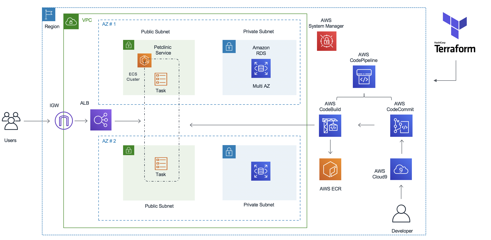
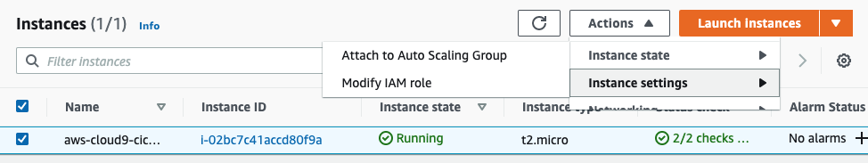
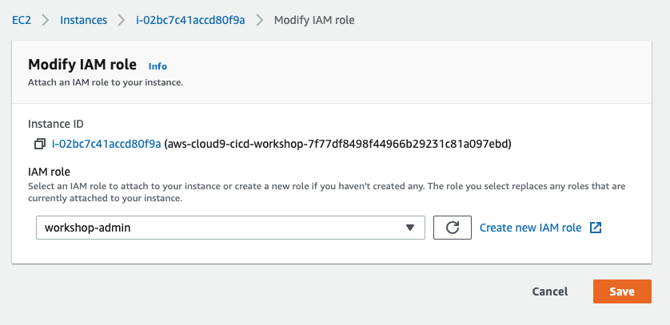

# Build and Deploy Spring Petclinic Application to Amazon ECS (Fargate) using Terraform and AWS CodePipeline


[](https://gitpod.io/#https://github.com/aws/aws-cdk)
[](https://badge.fury.io/js/aws-cdk)
[](https://badge.fury.io/py/aws-cdk.core)
[](https://badge.fury.io/nu/Amazon.CDK)

## Introduction

This workshop is designed to enable engineers to get some hands-on experience using AWS CI/CD tools to build pipelines for ECS workloads. The workshop consists of a number of lab modules, each designed to demonstrate a CI/CD pattern. You will be using AWS services like AWS CodePipeline, AWS CodeCommit, AWS CodeBuild and AWS CodeDeploy. 

## Background

The Spring PetClinic sample application is designed to show how the Spring application framework can be used to build simple, but powerful database-oriented applications. It uses AWS RDS (MySQL) at the backend and it will demonstrate the use of Spring's core functionality. The Spring Framework is a collection of small, well-focused, loosely coupled Java frameworks that can be used independently or collectively to build industrial strength applications of many different types. 

## Contributors

1. Irshad A Buchh, Amazon Web Services
2. Mike Rizzo, Amazon Web Services

## Architecture


## Prerequisites

Before you build the whole infrastructure, including your CI/CD pipeline, you will need to meet the following pre-requisites.

### AWS account

Ensure you have access to an AWS account, and a set of credentials with *Administrator* permissions. **Note:** In a production environment we would recommend locking permissions down to the bare minimum needed to operate the pipeline.

### Create an AWS Cloud9 environment

Log into the AWS Management Console and search for Cloud9 services in the search bar. Click Cloud9 and create an AWS Cloud9 environment in the `us-east-1` region based on Amazon Linux 2.

### Configure the AWS Cloud9 environment

Launch the AWS Cloud9 IDE. Close the `Welcome` tab and open a new `Terminal` tab.


#### Create and attach an IAM role for your Cloud9 instance

By default, Cloud9 manages temporary IAM credentials for you.  Unfortunately these are incomaptible with Terraform. To get around this you need to disable Cloud9 temporary credentials, and create and attach an IAM role for your Cloud9 instance.

1. Follow [this deep link to create an IAM role with Administrator access.](https://console.aws.amazon.com/iam/home#/roles$new?step=review&commonUseCase=EC2%2BEC2&selectedUseCase=EC2&policies=arn:aws:iam::aws:policy%2FAdministratorAccess)
1. Confirm that **AWS service** and **EC2** are selected, then click **Next** to view permissions.
1. Confirm that **AdministratorAccess** is checked, then click **Next: Tags** to assign tags.
1. Take the defaults, and click **Next: Review** to review.
1. Enter **workshop-admin** for the Name, and click **Create role**.

1. Follow [this deep link to find your Cloud9 EC2 instance](https://console.aws.amazon.com/ec2/v2/home?#Instances:tag:Name=aws-cloud9-;sort=desc:launchTime)
1. Select the instance, then choose **Actions / Instance Settings / Modify IAM Role**. Note: If you cannot find this menu option, then look under **Actions / Security / Modify IAM Role** instead.

1. Choose **workshop-admin** from the **IAM Role** drop down, and select **Apply**

1. Return to your workspace and click the gear icon (in top right corner), or click to open a new tab and choose "Open Preferences"
1. Select **AWS SETTINGS**
1. Turn off **AWS managed temporary credentials**
1. Close the Preferences tab

1. In the Cloud9 terminal pane, execute the command:
    ```bash
    rm -vf ${HOME}/.aws/credentials
    ```
1. As a final check, use the [GetCallerIdentity](https://docs.aws.amazon.com/cli/latest/reference/sts/get-caller-identity.html) CLI command to validate that the Cloud9 IDE is using the correct IAM role.
    ```bash
    aws sts get-caller-identity --query Arn | grep workshop-admin -q && echo "IAM role valid" || echo "IAM role NOT valid"
    ```

#### Upgrade awscli
Ensure you are running the latest version of AWS CLI:

```bash
aws --version
pip install awscli --upgrade --user
```

Run `aws configure` to configure your region. Leave all the other fields blank. You should have something like:

```
admin:~/environment $ aws configure
AWS Access Key ID [None]: 
AWS Secret Access Key [None]: 
Default region name [None]: us-east-1
Default output format [None]: 
```


#### Install Terraform

Download and install Terraform:

```bash
wget https://releases.hashicorp.com/terraform/0.13.4/terraform_0.13.4_linux_amd64.zip
unzip terraform_0.13.4_linux_amd64.zip
sudo mv terraform /usr/local/bin/
export PATH=$PATH:/usr/local/bin/terraform
```

Verify that you can run Terraform:

```bash
terraform version
```

<!---
This is no longer required as we get creds from the IAM role

- Set up a profile using your credentials as described in the [AWS CLI Configuration and credential file settings](https://docs.aws.amazon.com/cli/latest/userguide/cli-configure-files.html).
-->


#### Install workshop files

You will need to import the workshop files into your Cloud9 environment:

```bash
wget https://github.com/aws-samples/aws-ecs-cicd-terraform/archive/master.zip
unzip master.zip
cd aws-ecs-cicd-terraform-master
```


## Build the infrastructure and pipeline

We shall use Terraform to build the above architecture including the AWS CodePipeline.

**Note:** This workshop will create chargeable resources in your account. When finished, please make sure you clean up resources as instructed at the end.

### Set up SSM parameter for DB passwd

```bash
aws ssm put-parameter --name /database/password  --value mysqlpassword --type SecureString
```

### Edit terraform variables

```bash
cd terraform
```

Edit `terraform.tfvars`, leave the `aws_profile` as `"default"`, and set `aws_region` to the correct value for your environment.

### Build

Initialise Terraform:

```bash
terraform init
```

Build the infrastructure and pipeline using terraform:

```bash
terraform apply
```

Terraform will display an action plan. When asked whether you want to proceed with the actions, enter `yes`.

Wait for Terraform to complete the build before proceeding. It will take few minutes to complete “terraform apply” 

### Explore the stack you have built

Once the build is complete, you can explore your environment using the AWS console:
- View the RDS database using the [Amazon RDS console](https://console.aws.amazon.com/rds).
- View the ALB using the [Amazon EC2 console](https://console.aws.amazon.com/ec2).
- View the ECS cluster using the [Amazon ECS console](https://console.aws.amazon.com/ecs).
- View the ECR repo using the [Amazon ECR console](https://console.aws.amazon.com/ecr).
- View the CodeCommit repo using the [AWS CodeCommit console](https://console.aws.amazon.com/codecommit).
- View the CodeBuild project using the [AWS CodeBuild console](https://console.aws.amazon.com/codebuild).
- View the pipeline using the [AWS CodePipeline console](https://console.aws.amazon.com/codepipeline).

Note that your pipeline starts in a failed state. That is because there is no code to build in the CodeCommit repo! In the next step you will push the petclinic app into the repo to trigger the pipeline.


## Deploy petclinic application using the pipeline

You will now use git to push the petclinic application through the pipeline.


### Set up a local git repo for the petclinic application

Start by switching to the `petclinic` directory:

```bash
cd ../petclinic
```

Set up your git username and email address:

```bash
git config --global user.name "Your Name"
git config --global user.email you@example.com
```

Now ceate a local git repo for petclinic as follows:

```bash
git init
git add .
git commit -m "Baseline commit"
```

### Set up the remote CodeCommit repo

An AWS CodeCommit repo was built as part of the pipeline you created. You will now set this up as a remote repo for your local petclinic repo.

For authentication purposes, you can use the AWS IAM git credential helper to generate git credentials based on your IAM role permissions. Run:

```bash
git config --global credential.helper '!aws codecommit credential-helper $@'
git config --global credential.UseHttpPath true
```

From the output of the Terraform build, note the Terraform output `source_repo_clone_url_http`.

```bash
cd ../terraform
export tf_source_repo_clone_url_http=$(terraform output source_repo_clone_url_http)
```

Set this up as a remote for your git repo as follows:

```bash
cd ../petclinic
git remote add origin $tf_source_repo_clone_url_http
git remote -v
```

You should see something like:

```bash
origin  https://git-codecommit.eu-west-2.amazonaws.com/v1/repos/petclinic (fetch)
origin  https://git-codecommit.eu-west-2.amazonaws.com/v1/repos/petclinic (push)
```


### Trigger the pipeline

To trigger the pipeline, push the master branch to the remote as follows:

```bash
git push -u origin master
```

The pipeline will pull the code, build the docker image, push it to ECR, and deploy it to your ECS cluster. This will take a few minutes.
You can monitor the pipeline in the [AWS CodePipeline console](https://console.aws.amazon.com/codepipeline).


### Test the application

From the output of the Terraform build, note the Terraform output `alb_address`.

```bash
cd ../terraform
export tf_alb_address=$(terraform output alb_address)
echo $tf_alb_address
```

Use this in your browser to access the application.


## Push a change through the pipeline and re-test

The pipeline can now be used to deploy any changes to the application.

You can try this out by changing the welcome message as follows:

```
cd ../petclinic
vi src/main/resources/messages/messages.properties
```
Change the value for the welcome string, for example, to "Hello".

Commit the change:

```
git add .
git commit -m "Changed welcome string"
```

Push the change to trigger pipeline:

```bash
git push origin master
```

As before, you can use the console to observe the progression of the change through the pipeline. Once done, verify that the application is working with the modified welcome message.

## Tearing down the stack

Make sure that you remember to tear down the stack when finshed to avoid unnecessary charges. You can free up resources as follows:

```
cd ../terraform
terraform destroy
```

When prompted enter `yes` to allow the stack termination to proceed.

Once complete, note that you will have to manually empty and delete the S3 bucket used by the pipeline.
