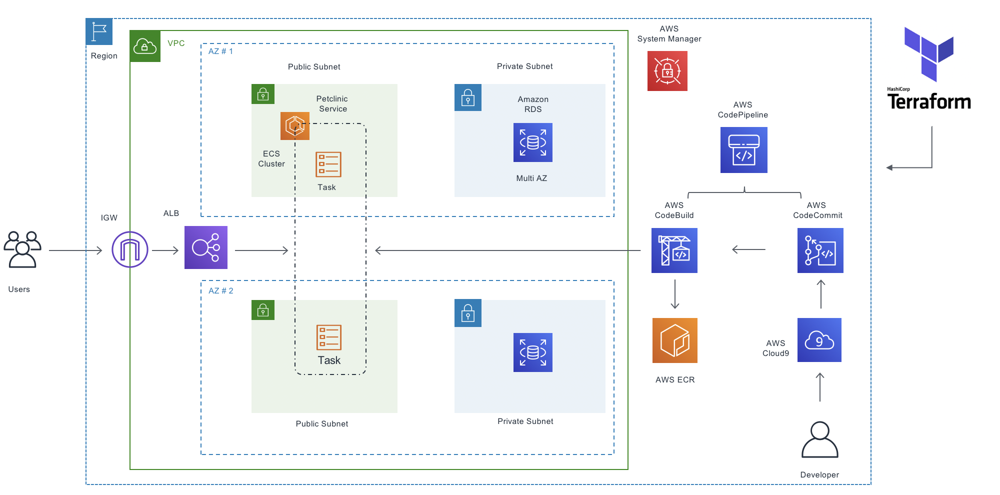

# Architecture
Time Estimate: 15 - 20 minutes  

??? info "What is AWS Fargate?"
    AWS Fargate is a serverless compute engine for containers that works with both Amazon Elastic Container Service (ECS) and Amazon Elastic Kubernetes Service (EKS). Fargate makes it easy for you to focus on building your applications. Fargate removes the need to provision and manage servers, lets you specify and pay for resources per application, and improves security through application isolation by design.
With Fargate, you can focus on building and operating your applications whether you are running it with ECS or EKS. You only interact with and pay for your containers, and you avoid the operational overhead of scaling, patching, securing, and managing servers. Fargate ensures that the infrastructure your containers run on is always up-to-date with the required patches.

With Fargate, you get out-of-box observability through built-in integrations with other AWS services including Amazon CloudWatch Container Insights. Fargate allows you to gather metrics and logs for monitoring your applications through an extensive selection of third party tools with open interfaces.

??? info "What is Terraform?"
    Terraform is a tool for building, changing, and versioning infrastructure safely and efficiently. Terraform can manage existing and popular service providers as well as custom in-house solutions. 

Configuration files describe to Terraform the components needed to run a single application or your entire datacenter. Terraform generates an execution plan describing what it will do to reach the desired state, and then executes it to build the described infrastructure. As the configuration changes, Terraform is able to determine what changed and create incremental execution plans which can be applied.

The infrastructure Terraform can manage includes low-level components such as compute instances, storage, and networking, as well as high-level components such as DNS entries, SaaS features, etc.

