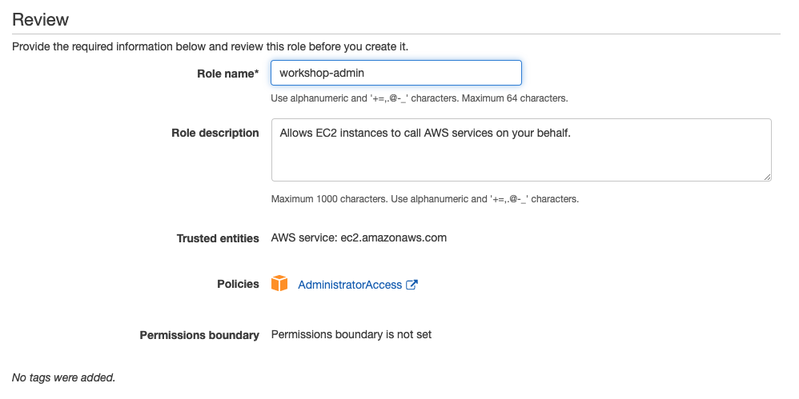

# Prerequisites

Before you build the whole infrastructure, including your CI/CD pipeline, you will need to meet the following pre-requisites.

### AWS account

Ensure you have access to an AWS account, and a set of credentials with Administrator permissions. Note: In a production environment we would recommend locking permissions down to the bare minimum needed to operate the pipeline.

### Create an AWS Cloud9 environment

??? info "What is AWS Cloud9?"
    AWS Cloud9 is a cloud-based integrated development environment (IDE) that lets you write, run, and debug your code with just a browser. It includes a code editor, debugger, and terminal. Cloud9 comes prepackaged with essential tools for popular programming languages, including JavaScript, Python, PHP, and more, so you don’t need to install files or configure your development machine to start new projects. Since your Cloud9 IDE is cloud-based, you can work on your projects from your office, home, or anywhere using an internet-connected machine. Cloud9 also provides a seamless experience for developing serverless applications enabling you to easily define resources, debug, and switch between local and remote execution of serverless applications. With Cloud9, you can quickly share your development environment with your team, enabling you to pair program and track each other's inputs in real time.
Log into the AWS Management Console and search for Cloud9 services in the search bar. Click Cloud9 and create an AWS Cloud9 environment in the us-east-1 region based on Amazon Linux 2.

### Configure the AWS Cloud9 environment

Launch the AWS Cloud9 IDE. Close the Welcome tab and open a new Terminal tab.


#### Create and attach an IAM role for your Cloud9 instance

By default, Cloud9 manages temporary IAM credentials for you.  Unfortunately these are incomaptible with Terraform. To get around this you need to disable Cloud9 temporary credentials, and create and attach an IAM role for your Cloud9 instance.

1. Follow [this deep link to create an IAM role with Administrator access.](https://console.aws.amazon.com/iam/home#/roles$new?step=review&commonUseCase=EC2%2BEC2&selectedUseCase=EC2&policies=arn:aws:iam::aws:policy%2FAdministratorAccess)
1. Confirm that **AWS service** and **EC2** are selected, then click **Next** to view permissions.
1. Confirm that **AdministratorAccess** is checked, then click **Next: Tags** to assign tags.
1. Take the defaults, and click **Next: Review** to review.
1. Enter **workshop-admin** for the Name, and click **Create role**.

1. Follow [this deep link to find your Cloud9 EC2 instance](https://console.aws.amazon.com/ec2/v2/home?#Instances:tag:Name=aws-cloud9-;sort=desc:launchTime)
1. Select the instance, then choose **Actions / Instance Settings / Modify IAM Role**. Note: If you cannot find this menu option, then look under **Actions / Security / Modify IAM Role** instead.

1. Choose **workshop-admin** from the **IAM Role** drop down, and select **Apply**

1. Return to your workspace and click the gear icon (in top right corner), or click to open a new tab and choose "Open Preferences"
1. Select **AWS SETTINGS**
1. Turn off **AWS managed temporary credentials**
1. Close the Preferences tab

1. In the Cloud9 terminal pane, execute the command:
    ```bash
    rm -vf ${HOME}/.aws/credentials
    ```
1. As a final check, use the [GetCallerIdentity](https://docs.aws.amazon.com/cli/latest/reference/sts/get-caller-identity.html) CLI command to validate that the Cloud9 IDE is using the correct IAM role.
    ```bash
    aws sts get-caller-identity --query Arn | grep workshop-admin -q && echo "IAM role valid" || echo "IAM role NOT valid"
    ```

#### Upgrade awscli
Ensure you are running the latest version of AWS CLI:

```bash
aws --version
pip install awscli --upgrade --user
```

Run `aws configure` to configure your region. Leave all the other fields blank. You should have something like:

```
admin:~/environment $ aws configure
AWS Access Key ID [None]: 
AWS Secret Access Key [None]: 
Default region name [None]: us-east-1
Default output format [None]: 
```


#### Install Terraform

Download and install Terraform:

```bash
wget https://releases.hashicorp.com/terraform/0.13.4/terraform_0.13.4_linux_amd64.zip
unzip terraform_0.13.4_linux_amd64.zip
sudo mv terraform /usr/local/bin/
export PATH=$PATH:/usr/local/bin/terraform
```

Verify that you can run Terraform:

```bash
terraform version
```

<!---
This is no longer required as we get creds from the IAM role

- Set up a profile using your credentials as described in the [AWS CLI Configuration and credential file settings](https://docs.aws.amazon.com/cli/latest/userguide/cli-configure-files.html).
-->


#### Install workshop files

You will need to import the workshop files into your Cloud9 environment:

```bash
wget https://github.com/aws-samples/aws-ecs-cicd-terraform/archive/master.zip
unzip master.zip
cd aws-ecs-cicd-terraform-master
```

